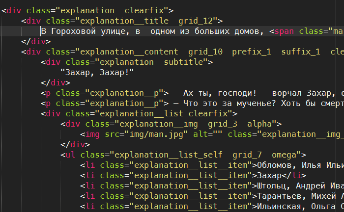
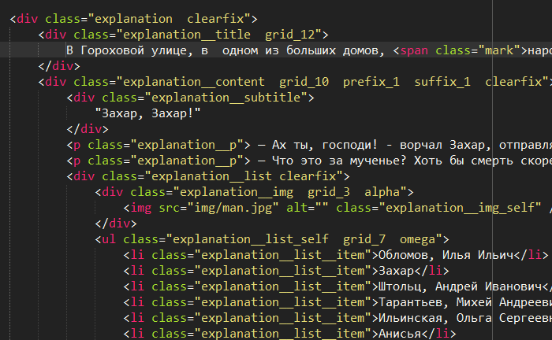
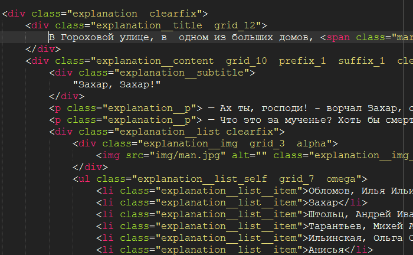
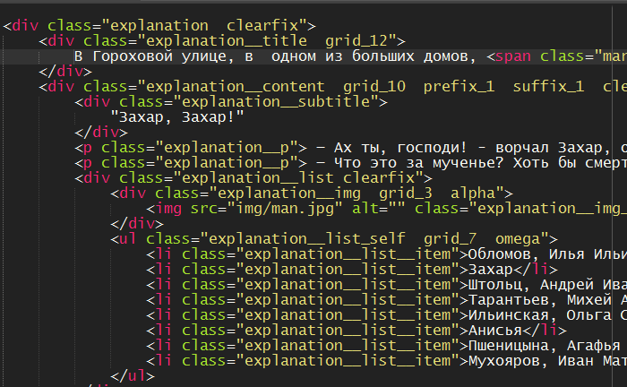

Meslo
============================

Полгода назад я наткнулся на восторженный комментарий по поводу шрифта [Meslo][1]. Попробовал его и сейчас не могу понять, как я использовал что-то другое раньше.

Meslo — изменённая версия шрифта Menlo от компани Apple, который, в свою очередь, создан из Bitstream Vera Sans Mono.

Основными претензиями автора шрифта к родительскому Menlo были стандартный интерлиньяж (межстрочное расстояние) и горизонтальное положение звёздочки. Поэтому Андре эти недочёты и выложил своё творение на гитхаб.  

*Cледите за первой строчкой текста:*

    

        
        
        
        
    

Из этих четырёх конкурентов я выбрал Meslo, по следующим причинам:

* Courier New отпадает сразу из-за проблем со сглаживанием и страшных засечек.
* Lucida Console отталкивает от себя склеившимися строками в элементах списка тем, что никак не выделяет ноль, что непростительно для шрифта, который используют для кода.
* Consolas имеет слишком тяжёлые буквы «g» и «r» и более слабый кернинг (межбуквенное расстояние), чем у Meslo. Более того, он проприетарный для платформы Windows.

Я благодарен шрифту Meslo за потрясающий кернинг, откалиброванное межстрочное расстояние, выделенный ноль и превосходный баланс черного и белого в типографском рисунке.

[1]: https://github.com/andreberg/Meslo-Font